# 0cuBank Bot 🏦

Bot de Discord para gestión de gremio en Albion Online. Incluye sistema de splits de botín, killboard automático, verificación de miembros y más.

## Funcionalidades

- **Splits de Botín** — Crea, asigna y distribuye splits con sistema de casas y cálculo automático de pagos
- **Killboard** — Monitoreo automático de kills y muertes del gremio con generación de imágenes
- **Verificación de Miembros** — Registro automático de jugadores validando contra la API de Albion Online
- **Mercado** — Consulta de precios de items (en desarrollo)

## Requisitos

- Python 3.11+
- Una cuenta de bot en [Discord Developer Portal](https://discord.com/developers/applications)
- Una base de datos en [MongoDB Atlas](https://www.mongodb.com/atlas)

## Instalación

1. **Clona el repositorio:**
   ```bash
   git clone https://github.com/tu-usuario/0cuBank.git
   cd 0cuBank
   ```

2. **Crea un entorno virtual:**
   ```bash
   python -m venv .venv
   # Windows
   .venv\Scripts\activate
   # Linux/Mac
   source .venv/bin/activate
   ```

3. **Instala las dependencias:**
   ```bash
   pip install -r requirements.txt
   ```

4. **Configura las variables de entorno:**
   ```bash
   cp .env.example .env
   ```
   Edita `.env` con tus credenciales y los IDs de tu servidor de Discord.

5. **Ejecuta el bot:**
   ```bash
   python bot.py
   ```

## Configuración

Revisa `.env.example` para ver las variables necesarias. Debes configurar las siguientes variables:

| Variable | Descripción | Tipo |
|---|---|---|
| `DISCORD_TOKEN` | Token de autenticación de tu bot de Discord. | Obligatoria |
| `MONGO_URI` | URI de conexión de tu base de datos MongoDB Atlas. | Obligatoria |
| `GUILD_ID` | ID del servidor de Discord donde opera el bot. | Obligatoria |
| `CANAL_SPLITS_ID` | ID del canal de texto público donde se anuncian los nuevos splits creados. | Obligatoria |
| `CATEGORIA_SPLITS_ID` | ID de la categoría del servidor de Discord bajo la cual se crearán los canales temporales e independientes para cada reparto de split. | Obligatoria |
| `CANAL_LOGS_ID` | ID del canal de logs donde el bot registrará errores y auditorías internas. | Obligatoria |
| `CANAL_DONACIONES_ID` | ID del canal donde se anuncian las liberaciones de casas y recordatorios de depósito de loot. | Obligatoria |
| `ROL_SPLIT_LOOTER_ID` | ID del rol de Discord asignado a los distribuidores de loot (Split Looters) autorizados para crear y tomar splits. | Obligatoria |

## Estructura del Proyecto

```
├── bot.py              # Punto de entrada principal
├── config.py           # Carga de variables de entorno
├── config.json         # Configuración adicional
├── requirements.txt    # Dependencias
├── cogs/
│   ├── killboard.py    # Sistema de killboard automático
│   ├── listeners.py    # Event listeners (placeholder)
│   ├── market.py       # Consulta de precios del mercado
│   ├── splits.py       # Sistema de splits de botín
│   └── verification.py # Verificación de miembros del gremio
├── db/
│   ├── connection.py   # Conexión a MongoDB
│   └── queries.py      # Queries de base de datos
└── utils/
    ├── config_utils.py # Utilidades para config.json
    ├── embed_factory.py# Fábrica de embeds (placeholder)
    └── price_fetcher.py# Obtención de precios de Albion
```


## Guía de Uso: Sistema de Splits de Botín 💸

> [!IMPORTANT]
> Para que la distribución de botín (splits) funcione fielmente a la lógica del juego, se requiere que el gremio disponga de una **Isla de Gremio con Casas y Cofres**, además de **pestañas gremiales en el cofre principal** donde los miembros depositarán el loot obtenido en las actividades para su posterior distribución.

A continuación se detalla el flujo completo de uso del bot:

### Paso 1: Registro del Contenido y Loot
Tras finalizar una actividad en el juego, un miembro del grupo debe publicar en Discord una captura de pantalla que muestre la **party (miembros participantes)** y especificar la **pestaña del cofre gremial** donde se guardó el botín.

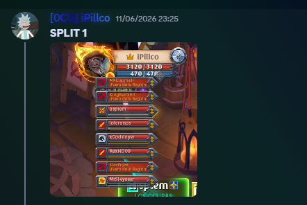

### Paso 2: Creación del Split
Un miembro con el rol de **Split Looter** (previamente configurado) inicia el proceso ejecutando el comando de barra diagonal:
```bash
/crear_split
```

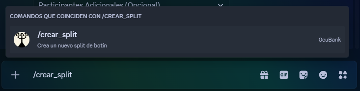

### Paso 3: Configuración del Split
El bot desplegará un menú interactivo para seleccionar la **pestaña de loot** y los **participantes** del contenido:

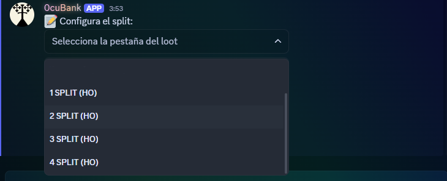
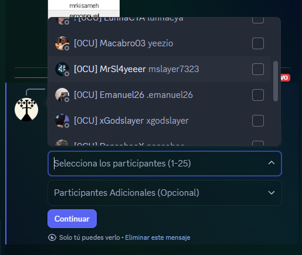

Al presionar **Continuar**, se abrirá un formulario modal para completar la información restante:
- **Título del Split**: Nombre descriptivo de la actividad.
- **Monto Total**: Valor estimado total del botín en plata.
- **Creador del Contenido**: Nombre del organizador del grupo.
- **Link Mensaje/Hilo o ID**: Enlace o ID del mensaje original del Paso 1.

> [!IMPORTANT]
> El enlace o ID del mensaje del Paso 1 es fundamental, ya que el bot creará automáticamente un hilo en ese mensaje para notificar e identificar a los participantes cuando se finalice el split.

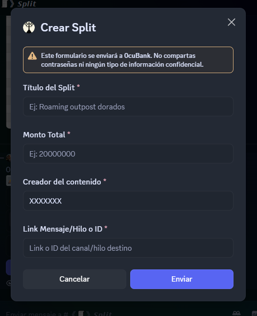

### Paso 4: Notificación y Asignación de Looter
Una vez creado el split, se enviará una notificación al canal designado de splits mencionando al rol de **Split Looter**.

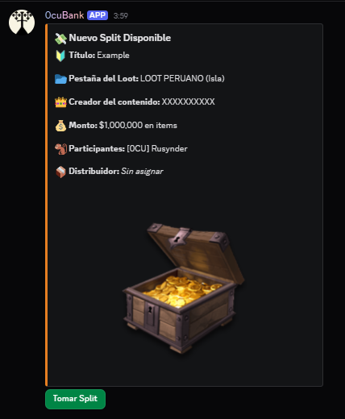

### Paso 5: Gestión y Distribución del Split
Al presionar el botón **Tomar Split**, el bot creará un **canal de texto privado** exclusivo para el distribuidor encargado. En este canal se gestionará la distribución y la asignación de las casas disponibles.

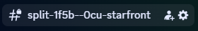
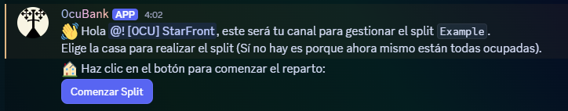

### Paso 6: Finalización y Cálculo de Pagos
Una vez distribuidos los ítems en las casas/cofres correspondientes en el juego, el distribuidor presiona **Finalizar Split** para confirmar los cálculos automáticos de pagos (descontando el 5% de comisión del splitter):

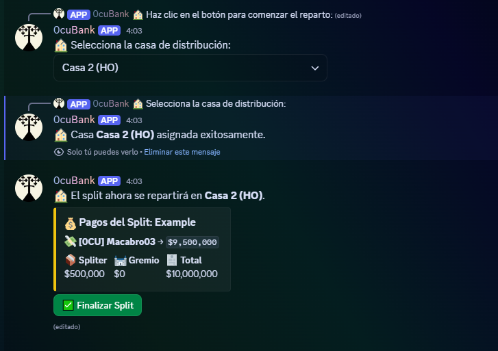
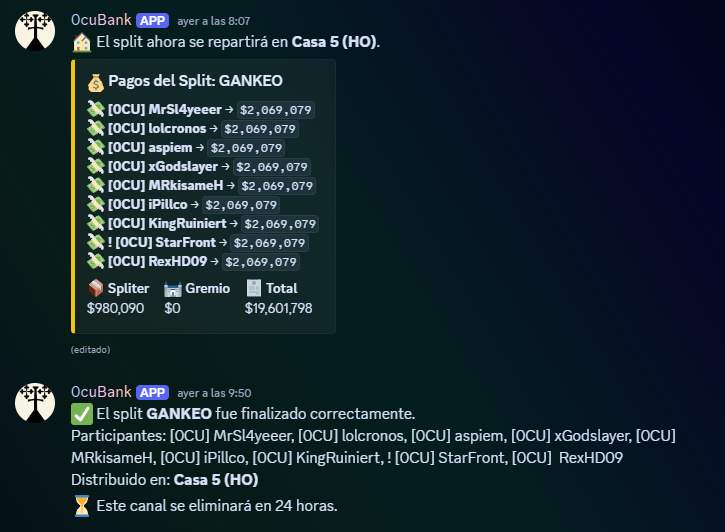

### Paso 7: Publicación del Resumen
El bot creará automáticamente un hilo en el mensaje original del Paso 1, mencionando a cada participante y detallando:
- Tipo de contenido realizado.
- Creador de contenido y Distribuidor.
- Casa/s asignada/s para retirar el botín.
- Monto exacto en plata correspondiente a cada miembro.
- Plazo límite para reclamarlo (2 días).

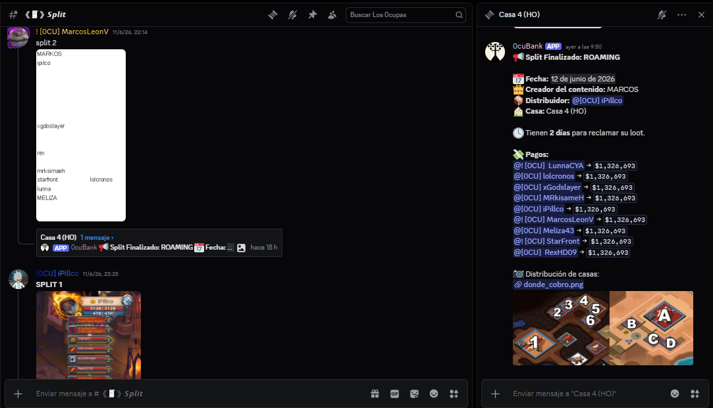

## Licencia

MIT

